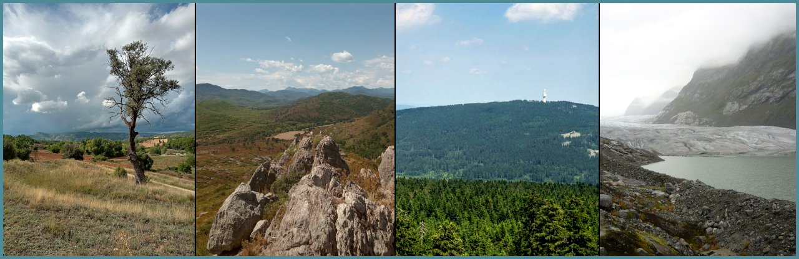

## Climate Dynamics Lab 🌀
The [Climate Dynamics Lab](https://mutz.science/) is a small, international network of scientists clustered around specific research topics (see [list of publications](https://mutz.science/res/pub.html)). We keep an open-door policy to anyone interested in working on these topics (as a researcher, developer or communicator). [Get in touch](mailto:sebastian@mutz.science) if you have questions, comments, or would like to join us!

## Languages and Tools 🛠

 

  

                 

<!--
Here are some ideas to get you started:

- 🔭 I’m currently working on ...
- 🌱 I’m currently learning ...
- 👯 I’m looking to collaborate on ...
- 🤔 I’m looking for help with ...
- 💬 Ask me about ...
- 📫 How to reach me: ...
- 😄 Pronouns: ...
- ⚡ Fun fact: ...
-->
